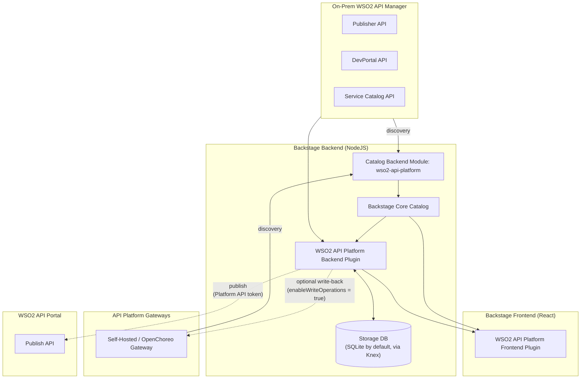
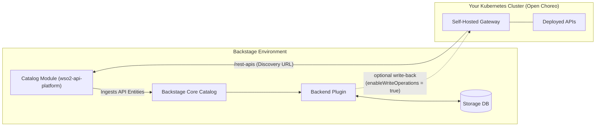

# WSO2 API Manager Backstage Plugins

This repository contains Backstage plugins for integrating with **WSO2 API Manager**, self-hosted/OpenChoreo API Platform Gateways, and the **WSO2 API Portal**. It automatically synchronizes your WSO2 API Platform content directly into the Backstage Software Catalog on a customizable schedule, and — for gateway-discovered APIs — layers a Backstage-managed storage layer on top so you can also **manage** those APIs (definitions, documents, and policies) directly from Backstage, not just browse them.

## Documentation

For a comprehensive guide on installing, configuring, and using these plugins, please refer to the official documentation:

- [WSO2 API Manager Documentation](https://apim.docs.wso2.com)

### Plugin API Specifications (OpenAPI)

Curious about how these plugins interact with your WSO2 instance? The [api-docs](./api-docs) folder contains the exact OpenAPI specifications and interactive documentation for all the WSO2 API Manager endpoints that these plugins rely on under the hood.

## Plugin Packages

This integration suite consists of three interconnected packages. You can find specific details and schemas for each package in their respective README files:

| Package                                                           | Description                                                                                                                                                                | README                                                                      |
| ----------------------------------------------------------------- | -------------------------------------------------------------------------------------------------------------------------------------------------------------------------- | --------------------------------------------------------------------------- |
| `@wso2/backstage-plugin-wso2-api-platform`                        | **Frontend Plugin:** Provides the global WSO2 API Platform page, Entity Tabs (Overview, Definition, Policies, Docs, Try-Out), and the UI for managing and publishing APIs. | [View README](./plugins/wso2-api-platform/README.md)                        |
| `@wso2/backstage-plugin-wso2-api-platform-backend`                | **Backend Plugin:** Handles secure API proxying, credentials generation, runtime operations, the Definition/Document/Policy storage layer, and WSO2 API Portal publishing. | [View README](./plugins/wso2-api-platform-backend/README.md)                |
| `@wso2/backstage-plugin-catalog-backend-module-wso2-api-platform` | **Catalog Module:** Responsible for the automatic discovery and ingestion of WSO2 APIs, API Products, MCP Servers, and Services into your Backstage Catalog.               | [View README](./plugins/catalog-backend-module-wso2-api-platform/README.md) |

## Architecture

The following diagram illustrates how the three plugin packages interact with your WSO2 API Platform, API Platform Gateways, the WSO2 API Portal, and Backstage's own storage:



### How they connect:

1. **Catalog Module (`catalog-backend-module-wso2-api-platform`)**: Periodically polls your WSO2 API Platform, on-prem APIM instances, and API Platform Gateways (self-hosted or OpenChoreo) to discover APIs, API Products, MCP Servers, and Services. It ingests this data into the **Backstage Core Catalog**. Discovery itself is unchanged for on-prem APIM entities.
2. **Frontend Plugin (`wso2-api-platform`)**: Reads the ingested data from the Core Catalog to render the global API Platform discovery page and the specific Entity tabs (Overview, Definition, Policies, Docs, Try-Out). It also sends requests to the Backend Plugin both for secure read-only operations (generating API keys, testing APIs) and, for gateway-discovered APIs, for managing definitions, documents, and policies, and for publishing to the API Portal.
3. **Backend Plugin (`wso2-api-platform-backend`)**: Acts as a secure bridge between the frontend UI and WSO2. Beyond proxying the WSO2 Publisher/DevPortal/Service Catalog APIs, it now also owns a **storage layer** (Definitions, Documents, Policies) for gateway-discovered APIs, applies the **gateway write-operations policy** described below, and relays requests to the **WSO2 API Portal**'s publish API.

## From Discovery to Management

Originally this suite only _discovered_ APIs and displayed what the gateway or APIM reported. It now also lets you **manage** gateway-discovered APIs (self-hosted gateway or OpenChoreo) directly from Backstage, backed by a small storage layer in the backend plugin. **On-prem APIM APIs are unaffected — they remain discovery/read-only**, served the same way as before (via the catalog's APIM annotations and the existing document content-proxy route).

### Storage: the foundation for everything below

The backend plugin owns a relational store (Knex-backed, defaulting to an embedded **SQLite** database with zero extra configuration — it inherits Backstage's own `backend.database` config and can be pointed at PostgreSQL the same way any other plugin's database can) for three kinds of gateway-API content:

- **Definitions** (OpenAPI/AsyncAPI content)
- **Documents** (markdown-only for gateway APIs)
- **Policies** are read live from the gateway rather than stored, but still routed through this same layer's write-operations gate (see below)

This is controlled by `wso2ApiPlatformStorage.enabled` (default `true`) — its own top-level config block, independent of `wso2ApiPlatform` (on-prem APIs already have their own backing store on the APIM instance itself). **With storage disabled, none of the management features below are available** — the relevant backend routes return `501 Not Implemented` and the frontend tabs fall back to a read-only/"unavailable" state, exactly as before this feature existed.

With storage **enabled**, gateway-discovered APIs gain:

- **API Definition management** — add, update, and hard-delete a definition, with a diff preview before every change.
- **API document management** — attach, edit, and delete markdown documents (previously only on-prem APIM APIs could have documents).
- **Policy management** — view (and, depending on mode, edit) request/response policies.
- **A working Try-Out console** — the Try-Out tab needs an actual API definition to build its request forms; for gateway-discovered APIs that definition now comes from this storage layer.
- **Publishing to the WSO2 API Portal** — publishing needs a definition and (optionally) documents to send, both sourced from storage, plus a per-API subscription plan selection (also stored here — see below).

### Gateway Write Operations Mode

A second, independent switch — `wso2ApiPlatformGateway.enableWriteOperations` (default `false`) — decides how far the plugin is allowed to go when it comes to touching the **gateway itself**, as opposed to the plugin's own storage:

| Mode                                          | `enableWriteOperations` | Behavior                                                                                                                                                                                                                                                                                                                                                                                 |
| --------------------------------------------- | ----------------------- | ---------------------------------------------------------------------------------------------------------------------------------------------------------------------------------------------------------------------------------------------------------------------------------------------------------------------------------------------------------------------------------------- |
| **Full Sync Mode**                            | `true`                  | Direct gateway write operations are enabled. Definition updates are validated against, and pushed to, the live gateway; policy management becomes editable and pushes changes to the gateway; deleting a plugin-managed definition is **blocked** (the gateway is treated as the source of truth once sync is mandatory).                                                                |
| **OpenChoreo / External Flow Mode** (default) | `false`                 | Policies are **read-only** in the plugin. Definition updates are permitted **without** blocking on a definition/gateway mismatch or forcing a direct gateway push — gateway synchronization is assumed to be delegated to an external OpenChoreo workflow. A diff preview is always shown before confirming a change. Deleting a plugin-managed definition **is** allowed (hard delete). |

> **For this initial release, Full Sync Mode is hard-locked off in code — setting `enableWriteOperations: true` in config has no effect.** A code-level constant (`GATEWAY_WRITE_OPERATIONS_LOCKED`, mirrored in both the backend and frontend plugins) forces this switch to `false` regardless of what any config layer says. This is deliberate: enabling Full Sync Mode today would let **any authenticated Backstage user with valid gateway credentials modify any API on the gateway**, since there is no per-API or per-team authorization model yet. Full Sync Mode is expected to be re-enabled, with that authorization gap closed, in a future release — see the backend plugin's README for the exact code locations.

Note that "disabled" here does not mean "fully locked down": by design, some actions that would normally be blocked by a gateway mismatch (for example, updating a stored definition without also updating the gateway's REST API artifact) are deliberately allowed in this mode, since an external process is expected to reconcile the gateway separately. This is a requirement of the OpenChoreo / External Flow model, not an oversight.

### API Definition Management & Diff Review

For gateway-discovered APIs, the Definition tab supports:

- **Add** a definition, **update** an existing one, or **hard-delete** it (delete is only available in OpenChoreo / External Flow Mode — see the table above).
- A **diff preview** ("Review Changes") is shown before any add/update is confirmed, comparing the incoming content against either the stored definition (External Flow Mode) or the live gateway definition (Full Sync Mode). If there is no meaningful diff, the review step is skipped and the change is applied directly.
- `info.title` and `info.version` are treated as immutable through this flow — even if an incoming definition changes them, the plugin restores the original values, in either mode.

### Policy Tab Redesign & Policy Attachment

The Policies tab now has two access modes, chosen automatically based on the API's source and the two switches above:

- **Editable** — only when the API is gateway-discovered, storage is enabled, _and_ `enableWriteOperations` is `true`. Presents a drag-and-drop policy editor with its own diff-preview step and an unsaved-changes guard.
- **Read-only** — in every other case (including when the gateway is temporarily unreachable). Presents a read-only list/details view of the policies currently applied.

### Gateway Update & Synchronization

Whenever a definition or policy change is saved, the backend performs two best-effort, advisory follow-up steps (failures are logged, not surfaced as request errors):

1. Refresh the entity in the Backstage catalog, so the catalog reflects the change immediately rather than waiting for the next scheduled discovery pass.
2. Trigger an out-of-cycle run of the catalog module's discovery provider, to keep the wider catalog in sync.

When `enableWriteOperations` is `true`, saving a definition or policy also pushes the change directly to the gateway itself (Full Sync Mode); when it's `false`, that direct gateway push is skipped (External Flow Mode).

### Publishing to the WSO2 API Portal

Gateway-discovered APIs can be published — metadata, definition, and markdown documents — to a WSO2 API Portal instance, independent of the `enableWriteOperations` switch. From the Overview tab's "Publish to API Portal" dialog you provide:

- A **Platform API access token** (kept in memory only, for the current browser session — never persisted or sent anywhere but the publish request itself; the dialog defaults to the last token used but always lets you override it).
- A **display name** (defaults to the entity's title, editable).
- A **production endpoint**, required, defaulting to the API's configured gateway runtime URL — offered as a dropdown when multiple runtime URLs are configured, but always overridable by typing a custom URL.
- An optional **sandbox endpoint**, offered the same way.

Only the **Platform API login** auth mode is currently supported for the API Portal integration — the backend never holds API Portal credentials itself, it simply relays the token the frontend obtained. An **IdP-based auth mode** is reserved in configuration for a future release but is not implemented yet.

**Subscription plans.** Next to the publish buttons, a Subscription Plans panel lets you toggle which plans apply to this API: the four built-in plans (Bronze, Silver, Gold, Unlimited) are always shown, plus any custom plan IDs your org has configured under `wso2ApiPlatformApiPortal.defaults.subscriptionPlans`. Each toggle saves immediately — the selection is stored per-API alongside the API's other metadata, and it's this stored selection (not the org's full configured plan list) that gets published the next time the API is published.

### Authenticating to the API Portal

Publishing needs a bearer token for the Portal's own REST API. Where that token comes from is controlled by `wso2ApiPlatformApiPortal.auth` in the **backend** plugin's config (`config.d.ts`), and it changes what the dialog shows. There are two top-level methods, and the second one has three strategies for actually obtaining the token.

#### 1. `platform-login` (default) — paste a token manually

```yaml
wso2ApiPlatformApiPortal:
  auth:
    mode: platform-login
```

The target API Portal is running its own local/dev login (a Platform API username+password session), which has no notion of an external IdP. The dialog shows a **Platform API Access Token** field; you paste in a token you obtained out of band (e.g. via the `ap` CLI or a curl login), and it's sent on that one publish call via the `x-api-portal-access-token` header. Nothing is cached — every publish needs the field filled in again (it does default to the last token used in that browser session, as a convenience).

#### 2. `idp` — the API Portal is backed by an external IdP

```yaml
wso2ApiPlatformApiPortal:
  auth:
    mode: idp
    idp:
      strategy: manual # | service-account | reuse-signin
```

Use this when the API Portal instance itself is configured against a real OIDC IdP (Asgardeo, Keycloak, Entra ID, ...) rather than local/dev login. `idp.strategy` then decides _how the plugin gets a token for that IdP_ — independently of whether the Portal itself is set up correctly, which is a separate, portal-side concern (see the backend README, linked below).

| Strategy           | What it's for                                                                                                                                                                                                                                                                                                                                                               | Dialog behavior                                                                                                                                                                                                                                                                                                 |
| ------------------ | --------------------------------------------------------------------------------------------------------------------------------------------------------------------------------------------------------------------------------------------------------------------------------------------------------------------------------------------------------------------------- | --------------------------------------------------------------------------------------------------------------------------------------------------------------------------------------------------------------------------------------------------------------------------------------------------------------- |
| `manual` (default) | Same as `platform-login`, but for an IdP-backed Portal: no automated token acquisition is configured, so a human still pastes an IdP-issued token per publish.                                                                                                                                                                                                              | Shows the token field, same as `platform-login`.                                                                                                                                                                                                                                                                |
| `service-account`  | The plugin backend authenticates as **its own** identity — a dedicated client-credentials app registered in the IdP, used for every publish regardless of who in Backstage triggered it. Use this when you want publishing to work without any human token-wrangling, and don't need per-user attribution on the Portal side.                                               | No token field at all — the backend acquires and caches its own token server-side. The dialog's Publish button just works.                                                                                                                                                                                      |
| `reuse-signin`     | Your organization already has Backstage's own primary sign-in wired up against the **same IdP** the API Portal trusts. Rather than a second login, the plugin reuses that existing session and asks it for a token scoped for the Portal. Use this when you want each publish attributed to the actual signed-in Backstage user, and Backstage is already on the right IdP. | No token field — the frontend silently fetches a token from your existing sign-in provider (a brief spinner while that happens). Falls back to the manual token field if the configured provider isn't actually registered in the app, or if fetching the token fails, so publishing is never blocked outright. |

Each strategy needs its own configuration, including the exact `dp:*` scopes the Portal expects and (for `service-account`) client credentials. **The full reference — required scopes per strategy, the IdP-side setup (Asgardeo walkthrough, `role`- vs `scope`-mode authorization, the `audience`/org-claim gotchas), and exact config shape for each strategy — lives in the backend plugin's README**, since that's where this config is actually read and validated:

- [`plugins/wso2-api-platform-backend/README.md` § Authentication](./plugins/wso2-api-platform-backend/README.md#authentication)
- [`plugins/wso2-api-platform-backend/README.md` § Setting up the API Portal for IdP-mode publishing](./plugins/wso2-api-platform-backend/README.md#setting-up-the-api-portal-for-idp-mode-publishing)

**Attribution note.** `service-account` means every publish looks identical in the Portal's own audit trail, regardless of which Backstage user triggered it (the plugin still records the real Backstage actor in its own database). `manual` and `reuse-signin` don't have that limitation — the token used is always the actual person's own.

## Self-Hosted Gateway Integration (Open Choreo)

If you are deploying self-hosted gateways using the [WSO2 API Platform Gateway Operator](https://openchoreo.dev/ecosystem/item/?id=wso2-api-platform-gateway) in your Kubernetes clusters, you can discover, display, and — once storage is enabled — manage all APIs deployed on them directly within Backstage.

By adding your gateway discovery URLs to the `wso2ApiPlatformGateway` configuration in your `app-config.yaml`, the catalog module will periodically poll the gateway's REST APIs (such as the `config_dump` endpoints) and synchronize your data plane APIs straight into the Backstage Software Catalog. From there, the backend plugin's storage layer and the frontend's Definition/Policies/Docs tabs let you manage those same APIs, subject to the storage and write-operations switches described above.



On-prem WSO2 API Manager APIs are discovered the same way they always have been and are not affected by any of the storage or write-operations features above — they remain read-only within Backstage.

## License

This project is licensed under the Apache License, Version 2.0.
